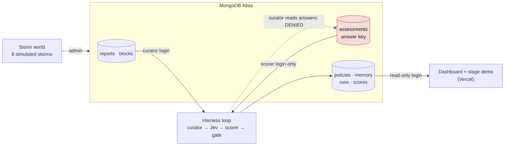
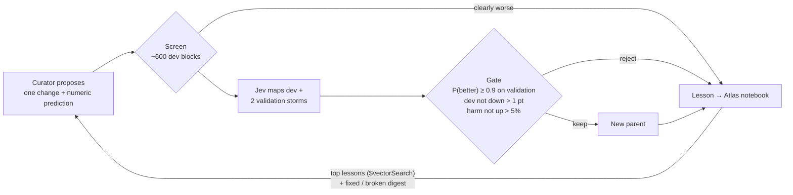

# Sightline: hurricane damage map

A harness that teaches itself what context to show **Jev**, TypeSafe's fast decision model, proves the result on
a storm it never saw, and can't cheat because MongoDB locks the answers away.

| | |
|---|---|
| **Start page (share this)** | https://sightline-jev.vercel.app |
| **Demo (default): story + live arena, recorded data** | https://sightline-jev.vercel.app/story.html (`?beat=1..7`, `?view=arena&autostart=1`) |
| **Seven-beat version** | https://sightline-jev.vercel.app/sightline.html |
| **Read-only API** | https://sightline-jev.vercel.app/api/state · `/api/map` · `/api/block` · `/api/reports` |
| **Code** | https://github.com/hughesbrayden/sightline |
| **Backend, one command** | `./sightline.sh help` |

- [The pitch](#the-pitch)
- [Architecture](#architecture)
- [The harness loop](#the-harness-loop)
- [Run the backend](#run-the-backend)
- [Score tonight's storm (once)](#score-tonights-storm-once)
- [Dashboard and stage demo](#dashboard-and-stage-demo)
- [Results](#results)
- [Robust loop vs naive loop vs random](#robust-loop-vs-naive-loop-vs-random)
- [Status](#status)
- [What we learned](#what-we-learned)
- [Video and submission](#video-and-submission)

## The pitch

**The problem.** Fast decision models answer in about a quarter of a second, but they see only a sliver of the
data, and that sliver decides whether they're right. Six hours after a hurricane, the evidence contradicts
itself: 911 calls filed at the wrong block, viral "verified" rumors, two agencies with two damage scales, and a
utility feed that says "de-energized" for a whole neighborhood. Shown the 12 nearest reports, Jev maps three past
storms at **56.7%** balanced accuracy and makes **265** false dispatches.

**What we built.** Sightline searches for the context policy, not the prompt or the weights:

1. A blind, stateless curator LLM proposes one change to the context policy (a "genome"). Everything it
   remembers comes from the harness: a lab notebook in Atlas Vector Search and a digest of what the last change
   fixed and broke.
2. The policy compiles to a MongoDB aggregation pipeline (`$geoNear`, `$match`, `$switch`) that picks exactly
   what Jev sees for each block.
3. Jev maps every block. A scorer grades the map against an official assessment that the curator's database
   login cannot read.
4. A statistical gate keeps a change only if it very likely helps on storms the curator never sees, without
   raising expected harm.
5. The final policy is scored once on a storm it never saw: tonight's NYC.

**Why it's different.**

- It optimizes *context*, the part of a fast-model system that decides whether the model can be right.
- It proves transfer: the curator never sees validation traces, and the held-out storm is scored once.
- It's tested against the obvious alternative. On four fresh storms, the robust loop beat a naive
  "keep whatever scores higher" loop and random mutation, block for block (see
  [the comparison](#robust-loop-vs-naive-loop-vs-random)).
- The answer lock is enforced by MongoDB roles, not by trusting the agent. A tripwire probe shows the refusal live:
  `denied (code 13): not authorized on jevly to find on assessments`.

**Tech stack.** TypeSafe Jev (`jev-latest` on a TypeSafe key, or `typesafe/jev-1.13` via OpenRouter); a curator
LLM (`z-ai/glm-5.2` via OpenRouter for `live-1`, a Claude subagent in the harness lab); MongoDB Atlas (geo queries,
time-series `runs`, Vector Search over the `memory` notebook with `voyage-4` embeddings from the Atlas model API,
collection-level custom roles); a Python harness; the Sightline design system; a Next.js dashboard on Vercel.

## Architecture

### The system

Four parts, three locked database logins. The answer key is readable only by the scorer; the curator's login is
refused (the tripwire probe shows it live).



## The harness loop

The loop follows the standard self-evolving pattern (execute → trace → propose → gate → keep, with lineage),
hardened against the failure modes that pattern is known for: overfitting to the storms it tunes on, noisy
feedback, bloat, and a curator with no memory.



| Weakness of a simple loop | What the robust loop does |
|---|---|
| **The gate is noise.** A 1-point margin on one validation storm, when hospital states are 4 blocks per storm and one block flip moves balanced accuracy about 2 points | A **paired, stratified bootstrap** on two validation storms (NYC0 + HOU0): child and parent compared on the same blocks, resampled within each true state. Keep only if P(better) ≥ 0.9 |
| One number decides everything | **Guardrails:** dev may not drop more than 1 point, and expected harm (5 × missed life-safety blocks + false dispatches) may not rise more than 5% |
| The curator only hears "fail" | A **diff digest**: which blocks the change fixed and broke, by state, with before/after traces. Predictions are numeric and scored against the result |
| No memory between stateless curator calls | A **vector lab notebook**: every generation writes a lesson (hypothesis, change, predicted vs actual, verdict) to Atlas `memory`, and the prompt retrieves the most relevant ones with `$vectorSearch`. A proposal close in meaning to a rejected lesson *and* making the same structural change is skipped unscored |
| Every idea costs a full evaluation | A **screen** on a stratified dev sample rejects clearly bad ideas at a fraction of the calls |
| Accepted rules pile up | A **prune pass** at the end removes each rule in turn and keeps only those that measurably help. The survivors are "what it learned" |

`live-1` (below) ran on the simple loop in `driver.py`: one validation storm and a 1-point margin. The robust loop
runs in the harness lab (`evolve.py`, branch `curator-inbox`) and was proven in
[the comparison](#robust-loop-vs-naive-loop-vs-random). Porting it into `driver.py` for the next live run is the
next step.

### Storms and splits

The city outlines match the Sightline design (stylized NYC, Miami, Houston, New Orleans). **The storms are
simulated** and deterministic: `storm_run.py build` regenerates them byte-for-byte.

| Split | Storms | Who sees what |
|---|---|---|
| dev | MIA1, HOU1, NOL1 (past storms) | Curator gets scores and 30 traces per generation |
| val | NYC0 (a past NYC storm) | The gate; the curator only learns pass or fail |
| heldout | NYC1 (tonight) | Scored once, at the end |
| cities | MIA2, HOU2, NOL2 (next season) | Scored once with the frozen policy (beat 7) |

There are 12 states: intact, flooded_street, flooded_homes, roof_damage, collapsed, fire, road_blocked, power_out,
downed_lines, shelter_open, hospital_ok, hospital_down. The life-safety states are collapsed, flooded_homes, fire
and hospital_down.

### Report sources

The storms are simulated, but every source speaks the vocabulary of its real-world counterpart (NYC, Hurricane
Sandy era). Each has a planted habit that a harness op can fix. The model sees one static post-storm snapshot.

| Source | Real-world counterpart | Vocabulary (examples) | Habit |
|---|---|---|---|
| `911-call` | NYPD / FDNY CAD call types | `STRUCTURAL: BUILDING COLLAPSE`, `UTILITY EMERGENCY - ELECTRIC`, `ASSIST CIVILIAN - NON-MEDICAL` | vague codes shared by several states; often filed one block off (FCC Phase II: 50–150 m); repeat calls on severe incidents |
| `311` | NYC 311 (complaint type / descriptor) | `Sewer / Street Flooding (SJ)`, `Damaged Tree / Entire Tree Has Fallen Down` | accurate but low-severity, buried in the everyday background (`HEATING / HEAT`, noise); power outages go to Con Ed, not 311 |
| `social-post` | Twitter/X | hashtags, `verified: yes/no` | viral "verified" (paid-badge) accounts spread false collapse, fire and flood reports |
| `city-survey` | FEMA Preliminary Damage Assessment | `Destroyed`, `Major`, `Minor`, `Affected`, `Inaccessible` | a second damage scale: "Major" means water inside homes, "Affected" means cosmetic only |
| `fire-dept` | NFIRS incident types | `111` building fire, `363` swift water rescue, `444` power line down, `461` collapse, `813` hurricane assessment | numeric codes that need translating |
| `pre-storm-map` | NYC PLUTO, evacuation zones, FEMA flood zones, LiDAR | `02 Multi-Family Walk-Up Buildings`; evacuation zone 1–6; flood zone AE/VE/X | a miscalibrated prior; every school is a designated evacuation center, but only some open |
| `drone-pass` | NOAA / Civil Air Patrol imagery (RescueNet / FloodNet labels) | `Building-Flooded`, `Road-Blocked`, `Building-Total-Destruction` | about 30% coverage in flight strips; overhead imagery can't see power outages |
| `utility-feed` | utility outage management | `energized`, `de-energized` by feeder | accurate but feeder-wide |

Calibration after the real-vocabulary cutover (TypeSafe `jev-latest`): baseline 59.1% dev / 52.5% validation;
builder reference 69.0% / 70.7%; dev false dispatches 207 → 58.

### Harness ops

| Op | Effect | Compiles to |
|---|---|---|
| `exclude_source` | Drop every report from a source | `$match: {source: {$nin: [...]}}` |
| `gloss_value` | Show `value (explanation)` for a source's codes | `$set` with `$switch` |
| `include_own {k}` | The block's own reports | `$match` on the block + `$limit` |
| `include_related {radius, only_values, sources, show}` | Reports from nearby blocks, listed raw or summarized | `$geoNear` + `$match` (+ `$group` for profiles) |
| `format: relative` | "Neighbor 1 block north" instead of coordinates | presentation |

### MongoDB (`jevly` database)

| Collection | Contents | Read by | Written by |
|---|---|---|---|
| `blocks` | town, x, y, `loc` (2d index), land use, elevation | dashboard | admin (loader) |
| `reports` | town, source, x, y, `loc` (2d index), value, text, hour | curator, dashboard | admin |
| `assessments` | **the answer key**: town, x, y, state | **scorer only** | admin |
| `policies` | lineage: gen, parent, status, ops, compiled_pipeline, hypothesis, prediction, dev_score, gate | curator, dashboard | curator |
| `runs` | time-series, one row per block per generation: pick, confidence, probabilities, the exact lines Jev saw, graded truth | scorer, dashboard | scorer |
| `gate_scores` | validation score per generation, plus refs (baseline, ceiling). Kept away from the curator | scorer, dashboard | scorer |
| `heldout_scores` | once-only scores for tonight and the other cities | scorer, dashboard | scorer |
| `memory` | findings and rejected ideas, with a vector index | curator, dashboard | curator |

### Files

| File | Role |
|---|---|
| `sightline.sh` | One entry point for everything below |
| `puzzle_draft/storm.py` | Storm generator: city outlines, damage rules, sources, coverage assertion |
| `puzzle_draft/storm_harness.py` | Genome → the exact text Jev sees; leak guard; ops → Mongo pipeline compiler |
| `puzzle_draft/storm_run.py` | `build`, `truth`, `load`, `preview`, `run` (scorer reads truth through the scorer login), `refs` |
| `puzzle_draft/driver.py` | The automatic loop behind `live-1`: curator → validate → memory check → evaluate → gate → lineage |
| `puzzle_draft/evolve.py`, `loopstats.py`, `notebook.py`, `mutate.py`, `abtest.py` | Harness lab (branch `curator-inbox`): the robust loop, bootstrap gate, Atlas vector notebook, random-mutation control, arm comparison |
| `puzzle_draft/storm_curator_brief.md` | Everything the curator is told (nothing about the planted habits) |
| `puzzle_draft/storm_genomes/` | `baseline.json` (12 nearest reports) and each run's best genome |
| `puzzle_draft/storm_reference/` | Builder's hand-written ceiling. **Never shown to the curator** |
| `puzzle_draft/db.py`, `mongo_setup.py`, `mongo_itest.py` | Logins, schema, roles, permission check, tripwire probe, integration test |
| `puzzle_draft/preflight.py`, `backfill_runs.py` | Access check; rebuild older `runs` rows |
| `dashboard/` | Next.js: read-only API, start page, `public/sightline.html`, `public/snapshot.json` |
| `demo/` | Sightline stage demo source (`src/app.js`, `src/live.js`), `build_live.sh`, `snapshot.mjs` |
| `ds-sightline/` | Sightline design system: tokens and components |

## Run the backend

Everything goes through `./sightline.sh`:

| Command | What it does |
|---|---|
| `./sightline.sh setup` | Install Python and dashboard dependencies; create `.env` if it's missing |
| `./sightline.sh preflight` | Check OpenRouter, Jev, the curator LLM and all four MongoDB logins (expect 12/12) |
| `./sightline.sh db local` | Local Atlas container + schema + locked logins, then the permission check, probe and integration test |
| `./sightline.sh db atlas` | Same on cloud Atlas (needs `MONGODB_URI_ADMIN` and `atlas auth login`) |
| `./sightline.sh world` | Generate the 8 storms, render the truth maps, load everything into MongoDB |
| `./sightline.sh calibrate` | Baseline (floor) vs the builder's reference (ceiling) on real Jev; stores the refs |
| `./sightline.sh loop --gens 8 --run live-2` | The automatic loop. Add `--resume` to continue a run, `--fake` for a free rehearsal |
| `./sightline.sh final live-1` | Score tonight's storm and the cities **once** (see below) |
| `./sightline.sh publish` | Record the run (offline fallback + start-page numbers) and rebuild the stage demo |
| `./sightline.sh dashboard` | Run the dashboard locally at http://localhost:3000 |
| `./sightline.sh deploy` | Deploy the dashboard to Vercel |
| `./sightline.sh validate [url]` | 39 contract checks against the API |
| `./sightline.sh all --gens 8 --run live-2` | preflight → world → calibrate → loop → publish (never `final`) |

**Setup (once).** Python 3.12 and Node 20 or newer. Run `./sightline.sh setup`, then fill in `.env`:

- `OPENROUTER_API_KEY`: one key covers Jev and the curator. **Jev calls need purchased OpenRouter credit.**
- `CURATOR_MODEL`: defaults to `z-ai/glm-5.2`.
- `MONGODB_URI_ADMIN`, `MONGODB_URI_CURATOR`, `MONGODB_URI_SCORER`, `MONGODB_URI_DASHBOARD`: ask Kishore privately,
  or run `./sightline.sh db local` to create your own. Never commit them.

**Look before you run.** These cost nothing:

```bash
python puzzle_draft/storm_run.py preview NYC1 12 5            # exact text Jev sees under the baseline
python puzzle_draft/storm_run.py preview NYC1 12 5 --genome puzzle_draft/storm_reference/ref_full.json
open out/storm/truth_sheet.png                                  # the 8 storms (after `world`)
```

**What a loop prints.** One line per generation: gen, status, dev, val, gate, tokens, seconds and the curator's
hypothesis. Maps land in `out/storm/runs/<run>_gXX/`; the lineage goes to Atlas `policies` and
`out/storm/lineage/<run>.jsonl`; the best genome goes to `out/storm/lineage/<run>_best.json`.

**Cost and time.** Each generation is 3,111 Jev calls: about $0.12 and about a minute, plus $0.01–0.04 and
20–90 s for the curator. Replays are free, because every Jev answer is cached in `puzzle_draft/cache/`. `--fake`
costs nothing but ignores glosses, so its numbers prove only that the pipeline runs.

## Score tonight's storm (once)

Run this only once the final genome is chosen. It needs `OPENROUTER_API_KEY` (with credit) and
`MONGODB_URI_SCORER`.

```bash
./sightline.sh final live-1       # baseline (gen 0) on NYC1, then live-1's best genome on NYC1 + MIA2/HOU2/NOL2
./sightline.sh publish && ./sightline.sh deploy
```

- It's about 3,800 Jev calls, roughly $0.15.
- It writes `heldout_scores` plus the map rows the demo shows. It refuses to score a genome twice.
- After `publish`, the start page and the demo switch from the validation storm to tonight's storm, and the
  "city it never saw" panel fills in.
- Never feed these numbers back into the loop.

## Dashboard and stage demo

**Start page:** https://sightline-jev.vercel.app shows the pitch, the held-out results, the learned rules, the
tripwire denial, both architecture diagrams and links to each beat. It's static, so it works even if the database is unreachable. Its
numbers come from `dashboard/lib/headline.json`, written by `./sightline.sh publish`.

**Default demo:** https://sightline-jev.vercel.app/story.html is Brayden's click-through story with the
**Story / Live arena** switch, fed by the recorded run `live-1` through `demo/src/live.js`:

- **Story tab** (Calm night, Storm hits, Generation 0, Fitness signal, Evolution, Replay, Any city): real maps,
  reports, the exact lines Jev read ("Now reading block…"), real misreads, the recorded lineage, tonight's
  once-only score and the three cities.
- **Live arena:** replays the recorded run generation by generation: the real hypotheses, backtest maps, gate
  verdicts and validation scores, labeled as a replay. A new run is started from the backend
  (`./sightline.sh loop`), not from the browser, so judges can't spend credit and the scorer login never sits on
  a public service.
- `?beat=N` jumps to a step; `?view=arena&autostart=1` opens the arena already playing. Both pages are pinned to
  `live-1` (`RUN=… bash demo/build_live.sh story` to pin another run).
- The example-data version stays at `/story-example.html`, with a banner.

**Seven-beat version:** https://sightline-jev.vercel.app/sightline.html is the same story as seven beats, fed by
the same recorded run:

1. Calm night
2. Storm hits
3. Generation 0
4. Fitness signal
5. Evolution
6. Replay
7. What it learned

- The maps, reports, misreads (with the line Jev misread), lineage, scores and rules are all real. Clicking a
  block shows the exact lines Jev saw.
- The demo night is tonight's held-out NYC storm (it fell back to the validation storm until that was scored).
- Query parameters: `?beat=N` jumps to a beat; `?run=<id>` picks a run; `?scenario=1` shows the original
  illustrative story; `?snapshot=1` forces the offline fallback.
- **Offline fallback:** if the API is unreachable, the demo loads `snapshot.json` (a recording of the run) and
  looks the same.
- Engine states are drawn in the design system's palette: flooded_homes → homes flooded, collapsed → destroyed,
  roof_damage → wind or roof, power_out and downed_lines → power out, hospital_down → major damage.

**API** (read-only `dashboard` login, server-side only; cross-origin GET allowed):

| Endpoint | Returns |
|---|---|
| `GET /api/state?run=live-1` | `run` {id, used, status, cost_usd, best_gen}; `refs` {baseline, ceiling: {dev, val}}; `gens` [{gen, parent, status, gate, dev, val, life_safety_found, false_dispatches, hypothesis, refuted_if, prediction, ops, pipeline, curator}]; `heldout`; `probe` |
| `GET /api/map?run=&gen=&town=` | {w, h, mask, states, colors, split, accuracy, cells: [{x, y, pick, conf, correct, truth}]}. Truth appears only where the scorer published it; tonight is empty until scored |
| `GET /api/block?run=&gen=&town=&x=&y=` | {lines: the exact text Jev saw, jev: {pick, conf, probs}, assessment, correct} |
| `GET /api/reports?town=NYC1&until_hour=6` | The report feed in arrival order: [{hour, source, x, y, value, text, verified}] |

Pass `gen` explicitly: the current policy is `gen = state.run.best_gen`. Without `gen`, `/api/map` shows the
newest generation, which may be a rejected one.

**Deploy.** The Vercel project is `sightline-dashboard`, root `dashboard/`, with `MONGODB_URI_DASHBOARD` as a
secret server-side variable (never add a `NEXT_PUBLIC_` variant). The old address,
https://sightline-dashboard.vercel.app, also works.

## LangSmith tracing

Set `LANGSMITH_API_KEY` and `LANGSMITH_TRACING=true` in `.env` (free Developer plan; project `jevly`). Then every
`./sightline.sh loop` generation becomes one trace (`puzzle_draft/tracing.py`):

- **Spans:** prompt + leak check → curator (model, tokens, cost, raw genome or the validation error, per retry) →
  memory check → evaluation (Jev over 3,111 blocks, dev and validation scores, the curator's 30-trace digest) → gate.
- **Feedback on each trace:** dev and validation balanced accuracy, life-safety recall, false dispatches, Brier,
  gate pass.
- **Links:** each generation's `policies.trace_url`, exposed by `/api/state` and shown in the Live arena
  ("Open this generation's LangSmith trace").
- **Blind by design:** the curator never reads LangSmith, and no answer key is sent.
- The first traced run is `live-traced`: https://sightline-jev.vercel.app/story.html?run=live-traced&view=arena
  It uses the new real-vocabulary storms, so its numbers aren't comparable with `live-1`.

**Don't run `./sightline.sh world` before judging.** `main` now generates the real-vocabulary storms, and `world`
reloads Atlas `reports` in that vocabulary, which would change the feed the pinned `live-1` demo shows. The answer
key is byte-identical in both worlds.

## Results

**Calibration on real Jev** (before any curator ran):

| Policy | Dev (pooled) | Validation (NYC0) | False dispatches (dev) |
|---|---|---|---|
| Baseline: the 12 nearest reports | 56.7% | 64.6% | 265 |
| Builder's reference (the ceiling) | 71.5% | 76.6% | 62 |

**The automatic run `live-1`** (real Jev, curator GLM-5.2, gate margin 1 point):

| Gen | Status | Dev | Val | Curator's hypothesis (abridged) |
|---|---|---|---|---|
| 0 | baseline | 56.7% | 64.6% | No harness: the 12 reports nearest the block |
| 1 | **kept** | 60.5% | 70.0% | Jev over-weights dramatic, often inaccurate social posts |
| 2 | rejected | 59.5% | 69.5% | Jev treats 911 dispatch codes as ground truth for the block |
| 3 | **kept** | 61.1% | **72.1%** | Raw neighbor listings make Jev over-weight dramatic life-safety reports |
| 4 | rejected | 62.7% | 72.9% | 911 codes taken at face value (+0.8 on validation, under the 1-point margin) |
| 5 | rejected | 61.8% | 69.3% | A radius-2 neighbor profile bleeds states onto intact blocks |
| 6 | rejected | 62.0% | 67.6% | City-survey letter grades misread |
| 7 | rejected | 59.9% | 71.8% | Fire-department severity values misread |
| 8 | rejected | 60.3% | 72.0% | Dramatic drone values over-weighted |
| 9 | not scored | – | – | Curator returned no valid genome |
| 10 | rejected | 59.3% | 65.2% | Utility status under-used |
| 11 | rejected | 59.4% | 72.0% | Drone observation values mis-mapped |
| 12 | rejected | 58.9% | 64.6% | 911 and fire-dept reports in neighbor profiles bleed life-safety states |
| 13 | not scored | – | – | Stopped: OpenRouter out of credit for Jev |

The final genome is generation 3. It drops social posts, shows the block's own reports, and summarizes
neighbors within 2 blocks instead of listing them. The curator's LLM cost for all 13 generations was $0.18.

**Tonight's storm (NYC1): held out, never trained on, scored once** with `./sightline.sh final live-1`:

| | Generation 0 (baseline) | Generation 3 (evolved) |
|---|---|---|
| Balanced accuracy | 62.7% | **67.0%** |
| False dispatches (life-safety call on an intact block) | 131 | **72** |
| Rescue-critical blocks found | 70 / 101 | **71 / 101** |

**Next season, cities it never saw** (frozen generation 3, scored once): Miami 68.6%, Houston 66.1%,
New Orleans 66.2% balanced accuracy, with 38, 55 and 30 false dispatches.

## Robust loop vs naive loop vs random

Does the robust loop matter, or would any loop do? Three arms, the same starting policy, the same Jev,
8 generations each, two runs per arm:

- **Robust:** everything in [the harness loop](#the-harness-loop). The curator is a blind Claude subagent that
  reads only its prompt file.
- **Naive:** the same curator and the same dev traces, with a generic brief. It keeps any change that raises the
  dev score. No validation gate, guardrails, notebook or diff digest.
- **Random:** no LLM. Random valid edits to the policy, kept on any dev gain. This separates "a smart curator"
  from "8 more tries".

Each run's final policy was then scored **once** on four fresh storms that no arm ever saw (MIA9, HOU9, NOL9,
NYC9). Tonight's NYC1 was not touched.

| Run | Test balanced accuracy (90% CI) | vs baseline | Kept / tried | New Jev calls |
|---|---|---|---|---|
| Baseline | 61.1% (57.7–64.2) | | | |
| **Robust 1** | **70.0%** (67.0–73.1) | +9.0, P 1.00 | 3 / 8 | 5.4k |
| **Robust 2** | **74.9%** (72.4–77.2) | +13.8, P 1.00 | 2 / 8 | 8.4k |
| Naive 1 | 67.4% (64.1–70.6) | +6.3, P 0.99 | 5 / 8 | 21.6k |
| Naive 2 | 62.9% (59.6–66.3) | +1.9, P 0.78 | 3 / 8 | 28.5k |
| Random 1 | 62.1% (58.9–65.4) | +1.1, P 0.69 | 2 / 8 | 13.8k |
| Random 2 | 64.5% (61.3–67.7) | +3.5, P 0.96 | 1 / 8 | |

- **Accuracy.** Compared block for block on the test storms, each robust run beats each naive and random run.
  The smallest margin is Robust 1 over Naive 1: +2.7 points, P 0.99.
- **Overfitting.** The naive rule kept a change that looked slightly better on dev (+0.4) but was probably worse
  on validation (−2.5, P 0.13), and Naive 2 ended barely above baseline. The robust gate turned down the same kind
  of change (dev +2.1, validation −0.1).
- **Cost.** The robust loop used 3–4× fewer new Jev calls than the naive loop: the screen and the notebook stop
  weak and repeated ideas before a full evaluation.
- **What it learned** (rules that survived the prune pass): drop social posts; read the city-survey letters as
  damage types; treat a utility "line fault" as downed lines; narrow which neighbor reports Jev sees.
- **Harm is not where it wins.** Expected harm on the test storms was 477–496 for the naive runs and 505–615 for
  the robust runs (baseline 728). Every evolved policy cuts false dispatches sharply (298 → 21–135), but
  life-safety recall dipped 1–3 points in the robust runs. The harm guardrail checks validation only, and that
  didn't fully carry over.

**Caveats.** The lab ran on the world version from before the real-vocabulary cutover, so its numbers aren't
comparable with `live-1`'s. Two harness bugs were found and fixed during the runs: the naive prompt mislabeled a
rejected candidate's traces for three generations of Naive 2, and one robust generation was wrongly skipped as a
repeat and then re-scored. The first harm guardrail (no rise at all) rejected a +5.9-point, P 1.00 validation win
over two extra false dispatches; it now allows a 5% rise.

## Status

| Area | Status |
|---|---|
| Storm world: 8 city-shaped storms, 12 states, 8 sources, coverage assertion | Done |
| MongoDB Atlas: schema, three locked logins, tripwire probe, integration test | Done |
| Harness + ops → pipeline compiler + scorer via the scorer login | Done |
| Automatic loop with gate, leak guard, memory check, lineage | Done; `live-1` ran 13 generations |
| Robust loop: bootstrap gate on 2 validation storms, harm guardrail, Atlas vector notebook, diff digest, prune | Done in the harness lab; beat naive and random on fresh storms. Not yet in `driver.py` |
| Dashboard API (39/39 checks), start page, stage demo on live data, offline fallback | Done, live at https://sightline-jev.vercel.app |
| One-command backend (`sightline.sh`) | Done |
| Tonight's storm + cities scored once | Done: NYC1 62.7% → 67.0%, false dispatches 131 → 72 |
| Video | To record |
| LangSmith traces, field-verified spot check | Not done (optional; cut first) |

**Remaining, in order.**

1. Record the video; add its link to `VIDEO_URL` in `dashboard/app/page.tsx`; redeploy.
2. Submit.

## What we learned

- **Calibrate the world before you trust the loop.** Our first world was too easy: the baseline reached 62% and
  a hand-written ceiling only 63.8%, which left the curator nothing to find. Sparser, messier sources opened a
  15-point gap.
- **Jev handles neighbor reports better than we expected.** Its real weak spots were unfamiliar scales and
  "verified" viral posts. Filtering the rumors cut false dispatches from 265 to 62 in the builder policy.
- **Well-meant context can hurt.** A cautious gloss on the utility feed dropped `power_out` accuracy from 82% to
  71%. A neighbor flood summary pulled 238 intact blocks to "flooded".
- **Some states are invisible without the right source.** Shelters and operating hospitals were right about 10%
  of the time until the pre-storm map listed facilities.
- **An open model can curate from traces alone.** GLM-5.2 found the rumor problem in its first generation, with
  no hints about the planted habits.
- **The gate does its job, and has a cost.** It rejected 9 of 11 scored proposals. One of them (gen 4) was a real
  +0.8 on validation, just under the 1-point noise margin, and validation then stayed at 72.1% for ten
  generations. A fixed margin on one storm is the wrong tool: the bootstrap gate on two storms asks how likely a
  change is to help, not whether it cleared a line.
- **Keeping whatever scores higher overfits.** The naive loop kept 8 of 16 changes and still finished below both
  robust runs on fresh storms.
- **A guardrail that is too strict costs twice.** It rejects the win, and then the notebook records the idea as a
  failure and blocks similar ones.
- **Operations matter at hackathon speed.** Curator replies sometimes come back empty (hidden reasoning uses up
  the token budget), and Jev calls need purchased credit. The driver now retries, logs the provider, and the demo
  ships a snapshot so it never depends on a live service.

**Still to try.**

- Port the robust loop into `driver.py` and run `live-2` on the real-vocabulary world.
- A deep-agent curator with a `validate_genome` tool and an in-memory file system only.
- A per-account exclusion op.
- Real data: NYC 311 open data and FEMA damage assessments.
- LangSmith experiments per generation.

## Video and submission

**Video (2–3 minutes).**

1. Screen-record the stage demo through its 7 beats.
2. Cut to a terminal running `./sightline.sh loop` (one line per generation).
3. Show the tripwire probe line.

Every number on screen is from the recorded run.

**Submission.**

- Demo: https://sightline-jev.vercel.app
- Code: https://github.com/hughesbrayden/sightline (start at this file)
- Video: the recording

**Safety.** The dashboard holds only the read-only login, and it can't read the answers. Never share the admin or
scorer credentials.

---

The hurricane storms are simulated; the city outlines are stylized.
