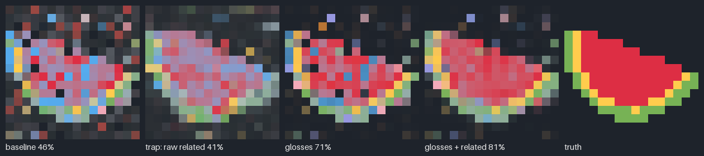

# Jevly

A harness that teaches itself what context to show **Jev**, a fast decision model. The testbed is a support-ticket routing puzzle where correct routing draws a hidden picture, so you can watch accuracy come into focus.

Built for the Harness Engineering & Model Wrangling Hackathon (MongoDB NYC, Sep 2026).



**Start with [COLLABORATION.md](COLLABORATION.md).** It covers the idea, current results, setup, commands and next steps.

Quick start:

```bash
pip install typesafe-sdk numpy pillow
```
```bash
python puzzle_draft/run.py run curator/genomes/baseline.json P1 --backend fake --private
```

Pictures: Twemoji (jdecked/twemoji), CC-BY 4.0.
