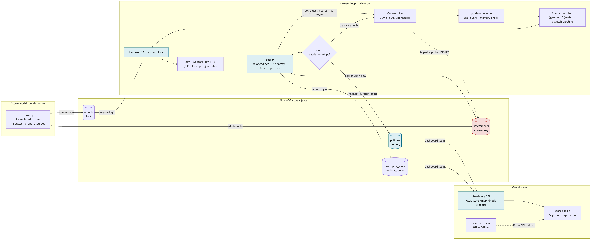
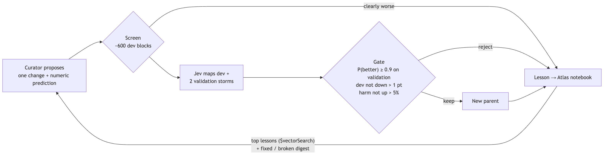

# Sightline

A harness that teaches itself what context to show **Jev**, TypeSafe's fast decision model, proves the result on
a storm it never saw, and can't cheat because MongoDB locks the answers away.

Six hours after a hurricane, the evidence contradicts itself: 911 calls filed at the wrong block, viral "verified"
rumors, two agencies with two damage scales, a utility feed that goes dark for a whole neighborhood. Jev answers in
a fraction of a second but sees only 12 lines per city block. Sightline evolves *which* 12 lines it sees.

Built for the Harness Engineering & Model Wrangling Hackathon (MongoDB NYC, September 2026) by Kishore Bhatia and
Brayden Hughes.

| | |
|---|---|
| **Start page** | https://sightline-jev.vercel.app (opens the demo) |
| **Demo: Summary · Story · Live arena · How we built this (recorded run)** | https://sightline-jev.vercel.app/story.html |
| **Runbook, architecture, results** | [DEMO.md](DEMO.md) |
| **Backend** | `./sightline.sh help` |

## Results (recorded run `live-2`)

Real Jev, a blind Claude curator, the robust gate, and simulated storms on stylized city maps:

| | Generation 0 | Evolved (generation 7) |
|---|---|---|
| **Tonight's NYC storm**: held out, never trained on, scored once | 57.9% balanced accuracy | **67.1%** |
| False dispatches tonight (life-safety call on an intact block) | 93 | **29** |
| Rescue-critical blocks found tonight | 77 / 101 | **83 / 101** |
| Validation storms (the gate) | 50.3% | **69.1%** (builder's ceiling 69.7%) |
| Next season, cities it never saw (Miami / Houston / New Orleans) | – | 77.6% / 67.3% / 62.5% |

Eight generations ran automatically; the gate kept four. DEMO.md also compares the robust loop with a naive loop
and random mutation on fresh storms, and keeps the earlier simple-loop run `live-1` for comparison.

## How it works



1. A **blind curator** LLM proposes one change to the context policy, with a numeric prediction.
2. The policy compiles to a **MongoDB aggregation pipeline** (`$geoNear`, `$match`, `$switch`) that picks exactly
   what Jev sees for each block.
3. **Jev maps every block** of three past storms and two validation storms.
4. A **scorer** grades the maps against the official assessment. Only the scorer's database login can read it; the
   curator's login is refused, and a tripwire probe shows that live.
5. A **robust gate** keeps the change only if a paired bootstrap on the validation storms says it's better
   (P ≥ 0.9) and harm doesn't rise. Every outcome becomes a lesson in an Atlas vector notebook for the next proposal.
6. The final policy is **scored once** on tonight's storm and on next season's storms in three other cities.



**Stack:** TypeSafe Jev · a blind Claude curator (or GLM-5.2 via OpenRouter) · MongoDB Atlas (geo queries,
time-series runs, vector search, collection-level custom roles) · Python harness · LangSmith tracing (optional) ·
Next.js dashboard on Vercel · the Sightline design system.

## Quick start

```bash
./sightline.sh setup                        # Python + dashboard deps; creates .env from .env.example
./sightline.sh preflight                    # checks Jev, the curator, MongoDB logins, LangSmith (expect 12/12)
python puzzle_draft/storm_run.py build      # generate the simulated storms locally (deterministic)
./sightline.sh loop --gens 1 --run my-try --fake   # free rehearsal: fake Jev, no database writes
```

A real run (`./sightline.sh loop --gens 8 --run <unique-name>`) costs about $0.15 per generation. It needs a Jev key
(TypeSafe, or OpenRouter with purchased credit) and the MongoDB logins in `.env`; ask the team, or create your own
database with `./sightline.sh db local`. The whole backend, including once-only scoring, publishing and deploying
the dashboard, is in [DEMO.md › Run the backend](DEMO.md#run-the-backend).

## Repository

| Path | What's there |
|---|---|
| `sightline.sh` | One entry point: setup, preflight, db, world, calibrate, loop, final, publish, deploy, validate |
| `puzzle_draft/storm*.py` | Storm world, harness (genome → the 12 lines Jev sees, ops → MongoDB pipeline), CLI and scorer |
| `puzzle_draft/driver.py` | The automatic loop: curator, validation, notebook, evaluation, robust gate, lineage, tracing |
| `puzzle_draft/mongo_*.py`, `db.py` | Schema, three locked logins, permission check, tripwire probe, integration test |
| `dashboard/` | Next.js: read-only API, start page, demo pages, offline snapshot |
| `demo/` | Sightline demo source (`story.js`, `app.js`, `live.js`) and build scripts |
| `ds-sightline/` | Sightline design system: tokens and components |
| `DEMO.md` | Pitch, architecture, runbook, results, what we learned |

The earlier prototype, a support-ticket routing puzzle where correct routing draws a picture
(`puzzle_draft/run.py`, see [COLLABORATION.md](COLLABORATION.md)), is still in the repo. Its pictures are Twemoji
(jdecked/twemoji), CC-BY 4.0.

The hurricane storms are simulated; the city outlines are stylized.
